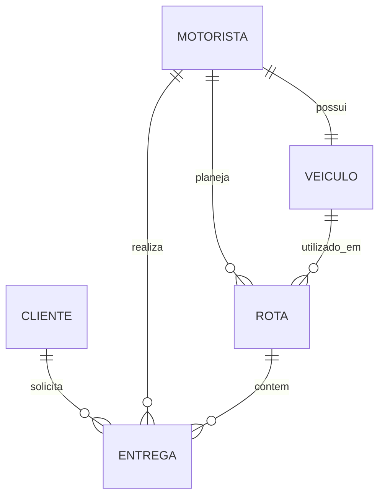

# Modelo de Dados

## 📐 ## Diagrama ER


```
┌─────────────────┐
│     Cliente     │
│─────────────────│
│ PK  id          │
│     nome        │
│ UK  email       │
│     telefone    │
└─────────────────┘
         │
         │ 1:N
         ↓
┌─────────────────────────────┐          ┌──────────────────┐
│         Entrega             │          │    Motorista     │
│─────────────────────────────│          │──────────────────│
│ PK  id                      │  N:1     │ PK  id           │
│ UK  codigo_rastreio         │←─────────│ FK  user (1:1)   │
│ FK  cliente_id              │          │     nome         │
│ FK  motorista_id (N:1)      │          │ UK  cpf          │
│ FK  rota_id (N:1)           │          │     cnh          │
│     endereco_origem         │          │     telefone     │
│     cep_origem              │          │     status       │
│     endereco_destino        │          │     data_cadastro│
│     cep_destino             │          │     token_convite│
│     status                  │          │     token_validade│
│     capacidade_necessaria   │          └──────────────────┘
│     valor_frete             │                   │
│     data_solicitacao        │                   │ 1:N
│     data_entrega_prevista   │                   ↓
│     data_entrega_real       │          ┌──────────────────┐
│     obs                     │          │     Veiculo      │
└─────────────────────────────┘          │──────────────────│
         │                               │ PK  id           │
         │ N:1                           │ UK  placa        │
         ↓                               │     modelo       │
┌─────────────────────────────┐          │     tipo         │
│          Rota               │  N:1     │     capacidade_  │
│─────────────────────────────│←─────────│     maxima       │
│ PK  id                      │          │     km_atual     │
│ FK  motorista_id            │  N:1     │     status       │
│ FK  veiculo_id              │←─────────│ FK  motorista_id │
│     nome                    │          │     (1:1)        │
│     descricao               │          └──────────────────┘
│     data_rota               │
│     status                  │
│     km_total_estimado       │
│     tempo_estimado          │          ┌──────────────────┐
└─────────────────────────────┘          │  PerfilUsuario   │
                                         │──────────────────│
┌──────────────────┐                    │ PK  id           │
│   User (Django)  │                    │ FK  user_id (1:1)│
│──────────────────│          1:1       │ FK  motorista_id │
│ PK  id           │←────────────────────│     (1:1)        │
│ UK  username     │                    │     tipo_usuario │
│     password     │                    └──────────────────┘
│     email        │
│     is_staff     │
│     is_active    │
└──────────────────┘
```

- Cliente (1) —— (N) Entrega
- Motorista (1) —— (N) Entrega
- Motorista (1) —— (1) Veículo
- Motorista (1) —— (N) Rota
- Veículo (1) —— (N) Rota
- Rota (1) —— (N) Entrega

---
## 📋 Modelo Entidade-Relacionamento (MER)

### 1. Cliente

Representa os destinatários das entregas.

**Atributos**:
- `id` (PK, Integer, Auto): Identificador único
- `nome` (String, 100): Nome completo do cliente
- `email` (Email, Unique): Email para contato
- `telefone` (String, 100): Telefone de contato

**Relacionamentos**:
- **1:N com Entrega**: Um cliente pode ter várias entregas

**Restrições**:
- `email` deve ser único no sistema
- Ordenação padrão por `nome`


---

### 2. Motorista

Representa os motoristas que realizam as entregas.

**Atributos**:
- `id` (PK, Integer, Auto): Identificador único
- `user` (FK, OneToOne, Null): Referência ao usuário Django
- `nome` (String, 100): Nome completo do motorista
- `cpf` (String, 14, Unique): CPF do motorista
- `cnh` (String, 2): Categoria da CNH (A, B, C, D, E)
- `telefone` (String, 20): Telefone de contato
- `status` (String, 20): Status atual do motorista
  - Opções: 'ativo', 'inativo', 'em_rota', 'disponivel'
- `data_cadastro` (Date, Auto): Data de cadastro no sistema
- `token_convite` (String, 100, Null): Token para convite
- `token_validade` (DateTime, Null): Validade do token

**Relacionamentos**:
- **1:1 com User**: Um motorista tem um usuário

- **1:N com Entrega**: Um motorista pode ter várias entregas

- **1:N com Rota**: Um motorista pode ter várias rotas

- **1:1 com Veículo**: Um motorista pode ter um veículo atual

**Restrições**:
- `cpf` deve ser único no sistema
- `cpf` é usado como username (apenas números)
- Ordenação padrão por `nome`


---

### 3. Veículo

Representa a frota de veículos utilizada nas entregas.

**Atributos**:
- `id` (PK, Integer, Auto): Identificador único
- `placa` (String, 10, Unique): Placa do veículo
- `modelo` (String, 100): Modelo do veículo
- `tipo` (String, 20): Tipo do veículo
  - Opções: 'carro', 'van', 'caminhao', 'moto'
- `capacidade_maxima` (Float): Capacidade máxima em kg
- `km_atual` (Integer, Default: 0): Quilometragem atual
- `status` (String, 20): Status atual do veículo
  - Opções: 'disponivel', 'em_uso', 'manutencao'
- `motorista` (FK, OneToOne, Null): Motorista atual do veículo

**Relacionamentos**:
- **1:1 com Motorista**: Um veículo pode estar com um motorista

- **1:N com Rota**: Um veículo pode ser usado em várias rotas

**Restrições**:
- `placa` deve ser única no sistema
- `capacidade_maxima` deve ser maior que 0
- Ordenação padrão por `placa`


---

### 4. Rota

Representa o planejamento de entregas para um motorista e veículo.

**Atributos**:
- `id` (PK, Integer, Auto): Identificador único
- `nome` (String, 100): Nome da rota
- `descricao` (Text, Null): Descrição detalhada
- `motorista` (FK): Motorista responsável
- `veiculo` (FK): Veículo utilizado
- `data_rota` (Date): Data de execução da rota
- `status` (String, 20): Status da rota
  - Opções: 'planejada', 'em_andamento', 'concluida'
- `km_total_estimado` (Integer, Default: 0): KM estimados
- `tempo_estimado` (Integer, Default: 0): Tempo estimado em minutos

**Relacionamentos**:
- **N:1 com Motorista**: Uma rota pertence a um motorista

- **N:1 com Veículo**: Uma rota utiliza um veículo


- **1:N com Entrega**: Uma rota pode ter várias entregas


**Restrições**:
- Motorista deve estar disponível ao criar rota
- Veículo deve estar disponível ao criar rota
- Ordenação padrão por `-data_rota` (mais recentes primeiro)

---

### 5. Entrega

Representa um pedido de transporte/entrega.

**Atributos**:
- `id` (PK, Integer, Auto): Identificador único
- `codigo_rastreio` (String, 20, Unique): Código para rastreamento
- `cliente` (FK): Cliente destinatário
- `motorista` (FK, Null): Motorista responsável
- `rota` (FK, Null): Rota associada
- `endereco_origem` (String, 255): Endereço de coleta
- `cep_origem` (String, 9): CEP de origem
- `endereco_destino` (String, 255): Endereço de entrega
- `cep_destino` (String, 9): CEP de destino
- `status` (String, 20): Status atual da entrega
  - Opções: 'pendente', 'em_transito', 'entregue', 'cancelada', 'remarcada'
- `capacidade_necessaria` (Float): Peso/volume necessário em kg
- `valor_frete` (Decimal, 10.2): Valor do frete
- `data_solicitacao` (Date, Auto): Data de criação
- `data_entrega_prevista` (Date, Null): Previsão de entrega
- `data_entrega_real` (Date, Null): Data real de entrega
- `obs` (Text, Null): Observações adicionais

**Relacionamentos**:
- **N:1 com Cliente**: Uma entrega pertence a um cliente

- **N:1 com Motorista**: Uma entrega pode ter um motorista

- **N:1 com Rota**: Uma entrega pode estar em uma rota

**Restrições**:
- `codigo_rastreio` deve ser único
- `capacidade_necessaria` deve ser maior que 0
- `valor_frete` deve ser maior ou igual a 0
- Uma entrega só pode estar em uma rota por vez
- Ao adicionar a rota, verifica capacidade disponível
- Ordenação padrão por `-data_solicitacao`

---

### 6. PerfilUsuario

Extensão do modelo User do Django para vincular com Motorista.

**Atributos**:
- `id` (PK, Integer, Auto): Identificador único
- `user` (FK, OneToOne): Referência ao User do Django
- `motorista` (FK, OneToOne, Null): Referência ao Motorista
- `tipo_usuario` (String, 20): Tipo de perfil
  - Opções: 'admin', 'motorista', 'cliente'

**Relacionamentos**:
- **1:1 com User**: Um perfil para cada usuário

- **1:1 com Motorista**: Perfil pode estar vinculado a motorista

**Restrições**:
- Criado automaticamente via signal quando User é criado
- Se usuário é de um motorista, `motorista_id` é preenchido

---
# 🎯 Documentação de Casos de Uso 

## Atores do Sistema

### 1. Administrador
**Descrição**: Gestor do sistema com acesso completo
**Responsabilidades**:
- Gerenciar motoristas, veículos, clientes
- Criar e gerenciar rotas
- Visualizar todos os dados do sistema
- Gerenciar permissões e acessos

### 2. Motorista
**Descrição**: Profissional responsável por realizar entregas
**Responsabilidades**:
- Visualizar suas próprias entregas
- Atualizar status de entregas
- Visualizar suas rotas
- Gerenciar seu próprio perfil

### 3. Cliente (Público)
**Descrição**: Pessoa que realiza consultas públicas
**Responsabilidades**:
- Rastrear entregas pelo código
- Visualizar informações públicas

---

## 📋 Diagrama de Casos de Uso

```
                    ┌─────────────────────────────────────┐
                    │      Sistema LogiTrans              │
                    │                                      │
                    │  ┌────────────────────────────────┐ │
    ┌──────────┐    │  │  UC01: Fazer Login             │ │
    │          │────┼──│  UC02: Fazer Logout            │ │
    │  Admin   │    │  │  UC03: Cadastrar Motorista     │ │
    │          │────┼──│  UC04: Gerenciar Acesso        │ │
    └──────────┘    │  │  UC05: Cadastrar Cliente       │ │
         │          │  │  UC06: Cadastrar Veículo       │ │
         │          │  │  UC07: Criar Rota              │ │
         │          │  │  UC08: Criar Entrega           │ │
         │          │  │  UC09: Atribuir Entrega à Rota│ │
         │          │  │  UC10: Finalizar Rota          │ │
         │          │  │  UC11: Ver Dashboard Admin     │ │
         │          │  │  UC12: Gerar Relatórios        │ │
         │          │  └────────────────────────────────┘ │
         │          │                                      │
         │          │  ┌────────────────────────────────┐ │
    ┌──────────┐    │  │  UC01: Fazer Login             │ │
    │          │────┼──│  UC02: Fazer Logout            │ │
    │Motorista │    │  │  UC13: Ver Minhas Entregas     │ │
    │          │────┼──│  UC14: Atualizar Status Entrega│ │
    └──────────┘    │  │  UC15: Ver Minhas Rotas        │ │
         │          │  │  UC16: Editar Meu Perfil       │ │
         │          │  │  UC17: Ver Dashboard Motorista │ │
         │          │  │  UC18: Primeiro Acesso         │ │
         │          │  └────────────────────────────────┘ │
         │          │                                      │
         │          │  ┌────────────────────────────────┐ │
    ┌──────────┐    │  │  UC19: Rastrear Entrega        │ │
    │          │────┼──│       (acesso público)          │ │
    │ Cliente  │    │  └────────────────────────────────┘ │
    │          │    │                                      │
    └──────────┘    └─────────────────────────────────────┘
```

---

## 📄 Casos de Uso Detalhados

### UC01: Fazer Login

**Ator Principal**: Administrador, Motorista

**Pré-condições**:
- Usuário possui credenciais válidas

**Fluxo Principal**:
1. Usuário acessa a página de login
2. Sistema exibe formulário com campos username e password
3. Usuário preenche credenciais
4. Usuário clica em "Entrar"
5. Sistema valida credenciais
6. Sistema identifica tipo de usuário
7. Sistema redireciona para página apropriada:
   - Admin → Home com dashboard completo
   - Motorista → Lista de entregas

**Fluxo Alternativo 1: Credenciais Inválidas**
- 5a. Sistema detecta credenciais inválidas
- 5b. Sistema exibe mensagem de erro
- 5c. Retorna ao passo 2

**Fluxo Alternativo 2: Conta Inativa**
- 5a. Sistema detecta conta inativa
- 5b. Sistema exibe mensagem informando bloqueio
- 5c. Finaliza caso de uso

**Pós-condições**:
- Usuário está autenticado
- Sessão criada
- Usuário redirecionado conforme perfil

---

### UC03: Cadastrar Motorista

**Ator Principal**: Administrador

**Pré-condições**:
- Usuário autenticado como admin

**Fluxo Principal**:
1. Admin acessa menu "Motoristas"
2. Admin clica em "Cadastrar Novo Motorista"
3. Sistema exibe formulário de cadastro
4. Admin preenche dados:
   - Nome completo
   - CPF
   - Categoria CNH
   - Telefone
   - Status inicial
5. Admin marca opção "Criar usuário de acesso"
6. Admin pode informar email (opcional)
7. Admin clica em "Cadastrar Motorista"
8. Sistema valida dados:
   - CPF único
   - CPF com 11 dígitos
   - Campos obrigatórios preenchidos
9. Sistema cria registro de motorista
10. Sistema cria usuário automaticamente:
    - Username = CPF (apenas números)
    - Senha gerada = 4 dígitos + "@Motorista"
    - Email = informado ou padrão
    - Conta ativa = true
11. Sistema adiciona usuário ao grupo "Motoristas"
12. Sistema exibe credenciais geradas
13. Sistema redireciona para lista de motoristas

**Fluxo Alternativo 1: CPF Duplicado**
- 8a. Sistema detecta CPF já cadastrado
- 8b. Sistema exibe erro "Este CPF já está cadastrado"
- 8c. Retorna ao passo 4

**Fluxo Alternativo 2: Não Criar Usuário**
- 5a. Admin desmarca opção "Criar usuário"
- 5b. Sistema cria apenas registro de motorista
- 5c. Pula passos 10-12

**Pós-condições**:
- Motorista cadastrado no sistema
- Usuário criado (se solicitado)
- Credenciais disponíveis para o motorista

---

### UC04: Gerenciar Acesso do Motorista

**Ator Principal**: Administrador

**Pré-condições**:
- Usuário autenticado como admin
- Motorista existe no sistema

**Fluxo Principal - Resetar Senha**:
1. Admin acessa lista de motoristas
2. Admin clica em ícone de gerenciamento
3. Sistema exibe opções de gerenciamento
4. Admin seleciona "Resetar Senha"
5. Admin opcionalmente informa email
6. Admin confirma ação
7. Sistema gera nova senha aleatória
8. Sistema atualiza senha do usuário
9. Sistema exibe nova senha
10. Se email fornecido, sistema envia credenciais por email
11. Sistema retorna à página de gerenciamento

**Fluxo Principal - Bloquear Acesso**:
1-3. (igual)
4. Admin seleciona "Bloquear Acesso"
5. Admin confirma ação
6. Sistema define user.is_active = False
7. Sistema exibe confirmação
8. Motorista não pode mais fazer login

**Fluxo Principal - Liberar Acesso**:
1-3. (igual)
4. Admin seleciona "Liberar Acesso"
5. Admin confirma ação
6. Sistema define user.is_active = True
7. Sistema exibe confirmação
8. Motorista pode fazer login novamente

**Pós-condições**:
- Acesso do motorista modificado conforme ação

---

### UC07: Criar Rota

**Ator Principal**: Administrador

**Pré-condições**:
- Usuário autenticado como admin
- Existe ao menos um motorista disponível
- Existe ao menos um veículo disponível

**Fluxo Principal**:
1. Admin acessa menu "Rotas"
2. Admin clica em "Criar Nova Rota"
3. Sistema exibe formulário com:
   - Motoristas disponíveis (status = 'disponivel')
   - Veículos disponíveis (status = 'disponivel')
4. Admin preenche dados:
   - Nome da rota
   - Descrição
   - Motorista
   - Veículo
   - Data da rota
   - KM estimado
   - Tempo estimado (minutos)
5. Admin clica em "Criar Rota"
6. Sistema valida:
   - Motorista está disponível
   - Veículo está disponível
   - Campos obrigatórios preenchidos
7. Sistema cria rota com status = 'planejada'
8. Sistema atualiza veiculo.status = 'em_uso'
9. Sistema atualiza motorista.status = 'em_rota'
10. Sistema redireciona para lista de rotas

**Fluxo Alternativo 1: Motorista Indisponível**
- 6a. Sistema detecta motorista não disponível
- 6b. Sistema exibe erro com status atual
- 6c. Retorna ao passo 4

**Fluxo Alternativo 2: Veículo Indisponível**
- 6a. Sistema detecta veículo não disponível
- 6b. Sistema exibe erro com status atual
- 6c. Retorna ao passo 4

**Pós-condições**:
- Rota criada
- Motorista marcado como em rota
- Veículo marcado como em uso

---

### UC08: Criar Entrega

**Ator Principal**: Administrador, Motorista

**Pré-condições**:
- Usuário autenticado
- Existe ao menos um cliente cadastrado

**Fluxo Principal**:
1. Usuário acessa menu "Entregas"
2. Usuário clica em "Cadastrar Nova Entrega"
3. Sistema exibe formulário
4. Usuário preenche dados:
   - Código de rastreio (único)
   - Cliente
   - Endereços de origem e destino
   - CEPs
   - Capacidade necessária (kg)
   - Valor do frete
   - Data prevista de entrega
   - Observações
5. Se admin, pode selecionar motorista e rota
6. Se motorista, sistema atribui automaticamente a ele
7. Usuário clica em "Salvar Entrega"
8. Sistema valida:
   - Código único
   - Capacidade > 0
   - Valor >= 0
   - Se rota informada, verifica capacidade disponível
9. Sistema cria entrega com status = 'pendente'
10. Sistema redireciona para lista de entregas

**Fluxo Alternativo 1: Código Duplicado**
- 8a. Sistema detecta código já existe
- 8b. Sistema exibe erro
- 8c. Retorna ao passo 4

**Fluxo Alternativo 2: Capacidade da Rota Excedida**
- 8a. Sistema calcula capacidade da rota
- 8b. Capacidade usada + nova entrega > capacidade do veículo
- 8c. Sistema exibe erro detalhado
- 8d. Retorna ao passo 4

**Pós-condições**:
- Entrega cadastrada
- Se rota informada, entrega vinculada

---

### UC09: Atribuir Entrega à Rota

**Ator Principal**: Administrador

**Pré-condições**:
- Usuário autenticado como admin
- Rota existe e não está concluída
- Entrega existe e não está em outra rota

**Fluxo Principal**:
1. Admin acessa detalhes de uma rota
2. Sistema exibe:
   - Informações da rota
   - Lista de entregas já atribuídas
   - Entregas disponíveis (sem rota, pendentes)
   - Capacidade utilizada/disponível
3. Admin seleciona entrega no dropdown
4. Admin clica em "Adicionar à Rota"
5. Sistema valida:
   - Entrega não está em outra rota
   - Capacidade não será excedida
6. Sistema atribui entrega.rota_id = rota.id
7. Sistema atualiza display de capacidade
8. Sistema exibe confirmação

**Fluxo Alternativo 1: Entrega Já em Rota**
- 5a. Sistema detecta entrega.rota_id != null
- 5b. Sistema exibe erro
- 5c. Retorna ao passo 3

**Fluxo Alternativo 2: Capacidade Excedida**
- 5a. Sistema calcula: capacidade_usada + capacidade_entrega
- 5b. Resultado > capacidade_maxima do veículo
- 5c. Sistema exibe erro detalhado com valores
- 5d. Retorna ao passo 3

**Pós-condições**:
- Entrega vinculada à rota
- Capacidade da rota atualizada

---

### UC10: Finalizar Rota

**Ator Principal**: Administrador

**Pré-condições**:
- Usuário autenticado como admin
- Rota existe
- Rota não está finalizada

**Fluxo Principal**:
1. Admin acessa lista de rotas
2. Admin clica em editar rota
3. Sistema exibe formulário de edição
4. Admin altera status para "concluída"
5. Admin clica em "Salvar"
6. Sistema atualiza rota.status = 'concluida'
7. Sistema atualiza veiculo.status = 'disponivel'
8. Sistema atualiza motorista.status = 'disponivel'
9. Sistema exibe confirmação
10. Sistema redireciona para lista de rotas

**Pós-condições**:
- Rota marcada como concluída
- Veículo disponível novamente
- Motorista disponível novamente

---

### UC13: Ver Minhas Entregas (Motorista)

**Ator Principal**: Motorista

**Pré-condições**:
- Usuário autenticado como motorista

**Fluxo Principal**:
1. Motorista faz login
2. Sistema redireciona automaticamente para lista de entregas
3. Sistema filtra apenas entregas do motorista logado
4. Sistema exibe:
   - Código de rastreio
   - Cliente
   - Origem e destino
   - Status
   - Data prevista
   - Observações
5. Motorista pode:
   - Ver detalhes de cada entrega
   - Editar suas entregas
   - Atualizar status

**Pós-condições**:
- Motorista visualiza suas entregas

---

### UC14: Atualizar Status da Entrega

**Ator Principal**: Administrador, Motorista

**Pré-condições**:
- Usuário autenticado
- Entrega existe
- Motorista só pode atualizar suas entregas

**Fluxo Principal**:
1. Usuário acessa lista de entregas
2. Usuário clica em editar entrega
3. Sistema exibe formulário de edição
4. Usuário altera status:
   - pendente → em_transito
   - em_transito → entregue
   - Qualquer → cancelada/remarcada
5. Se status = 'entregue', usuário informa data_entrega_real
6. Usuário clica em "Atualizar"
7. Sistema valida permissões
8. Sistema salva alterações
9. Sistema exibe confirmação
10. Sistema redireciona para lista

**Fluxo Alternativo: Motorista Editando Entrega de Outro**
- 7a. Sistema detecta entrega.motorista_id != usuario.motorista.id
- 7b. Sistema exibe erro "Acesso negado"
- 7c. Finaliza caso de uso

**Pós-condições**:
- Status da entrega atualizado

---

### UC18: Primeiro Acesso (Motorista)

**Ator Principal**: Motorista

**Pré-condições**:
- Motorista foi cadastrado pelo admin
- Motorista recebeu credenciais temporárias

**Fluxo Principal**:
1. Motorista acessa página de primeiro acesso
2. Sistema exibe formulário:
   - Username (CPF)
   - Senha temporária
   - Nova senha
   - Confirmar nova senha
3. Motorista preenche dados
4. Motorista clica em "Ativar Conta"
5. Sistema valida:
   - Credenciais temporárias corretas
   - Nova senha atende requisitos (mínimo 8 caracteres)
   - Senhas conferem
6. Sistema autentica usuário
7. Sistema atualiza senha
8. Sistema garante usuário no grupo "Motoristas"
9. Sistema faz login automático
10. Sistema exibe mensagem de sucesso
11. Sistema redireciona para dashboard

**Fluxo Alternativo 1: Senhas Não Conferem**
- 5a. nova_senha != confirmar_senha
- 5b. Sistema exibe erro
- 5c. Retorna ao passo 3

**Fluxo Alternativo 2: Senha Fraca**
- 5a. nova_senha tem menos de 8 caracteres
- 5b. Sistema exibe erro
- 5c. Retorna ao passo 3

**Pós-condições**:
- Senha atualizada
- Motorista logado
- Pode acessar o sistema normalmente

---

### UC19: Rastrear Entrega (Público)

**Ator Principal**: Cliente (não autenticado)

**Pré-condições**:
- Nenhuma (acesso público)

**Fluxo Principal**:
1. Usuário acessa página inicial
2. Sistema exibe campo de busca de rastreamento
3. Usuário digita código de rastreio
4. Usuário clica em "Consultar"
5. Sistema busca entrega por código
6. Sistema exibe informações da entrega:
   - Código de rastreio
   - Cliente (apenas nome)
   - Status atual
   - Data de solicitação
   - Data prevista de entrega
   - Data real (se entregue)
   - Endereço de destino
   - Observações (se houver)
7. Se entrega tem rota, exibe informações da rota

**Fluxo Alternativo: Entrega Não Encontrada**
- 5a. Sistema não encontra código
- 5b. Sistema exibe mensagem "Entrega não encontrada"
- 5c. Retorna ao passo 2

**Pós-condições**:
- Usuário visualizou informações da entrega

---
